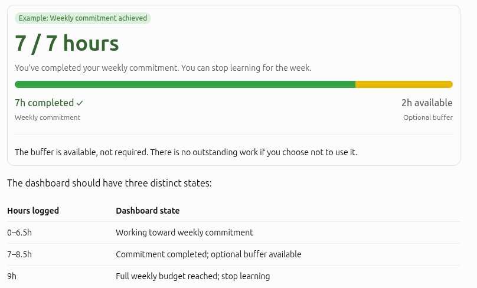
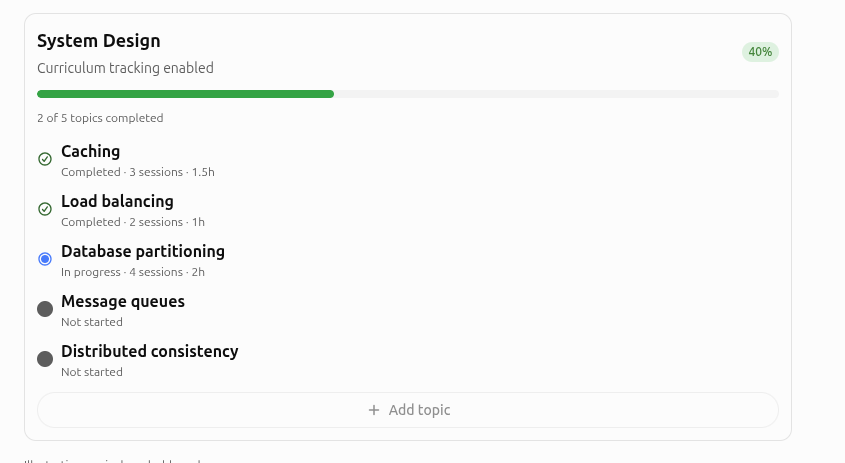
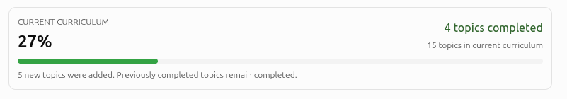
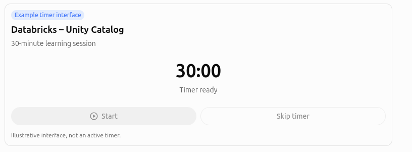

# Growth Budget — PRD

Flexible learning, curriculum progress, revision, and sustainable time management.
Study whatever interests you, log your time, and capture what you learned, optionally existing category and topic and mark topics as completed. track curriculum progress.

Weekly commitment: 7 hours
Optional buffer: 2 hours
Tracking week: Sunday – Saturday
Revision allocation: 1–3 slots
Curriculum: Optional

## 1. Weekly budget: commitment + buffer

Instead of a single 9-hour target, the dashboard will distinguish between committed learning time and optional additional learning.

Your normal weekly commitment is 7 hours. The remaining 2 hours are available when you have extra energy, an interesting topic, or an upcoming interview.

A key requirement: using the buffer should not become the new baseline.

Weekly summaries should report commitment completion separately from optional hours. Otherwise, nine hours could quietly become your expected minimum.

Revision time counts toward your weekly commitment and optional buffer, rather than being added on top.

## 2. Optional curriculum tracking

P0 · Core requirement

The application must support both structured and unstructured learning.

You can create a category, add topics to it, and optionally enable curriculum tracking for that category.

### Category requirements

Each category should support a name, optional description, list of topics, and a toggle for enabling curriculum tracking.

A category without a curriculum should still support ordinary learning sessions and accumulated time tracking.

### Topic requirements

| Property       | Purpose                                   |
|---------------:|:------------------------------------------|
| Name           | Topic title                               |
| Status         | Not started, In progress, Completed       |
| Sessions       | Linked learning activity                  |
| Total hours    | Automatically calculated                  |
| Last covered   | Date of most recent learning or revision |
| Completed on   | Date marked complete                      |
| Notes          | Optional learning material or references  |

A topic may require any number of sessions.

For example, you could study database partitioning for 30 minutes on Monday, another hour on Wednesday, and two hours the following week.

All sessions contribute to that topic's accumulated hours.

Completing a time slot must not automatically mark a topic as complete.

The user explicitly marks a topic complete when satisfied with their understanding.

Completed topics can still receive additional study or revision sessions without losing their completed status.

## 3. Curriculum progress bar

P0 · Core requirement

Curriculum progress should be calculated using completed topics:

Progress=(Completed topics​/total topics)×100

For example, completing 4 of 10 topics results in 40% curriculum progress.

This deliberately measures completion of your defined curriculum, not mastery of the entire subject.

The progress bar should appear only when curriculum tracking is enabled and the category contains at least one topic.

### What happens when you discover new topics?

Suppose you've completed 4 of 10 topics and then discover another 5 worth studying.

Your curriculum progress will change from 40% to approximately 27%.

That's mathematically correct, but it can be demotivating.

I'd address this by displaying both the percentage and an independent accomplishment count:

One potential future improvement would be curriculum versions, allowing you to preserve the completion percentage of an earlier learning plan while expanding its scope.

I wouldn't include versioning in the initial MVP.

## 5. Optional 30-minute timer

P1 · Post-MVP convenience feature

The application should offer an optional timer when starting a learning session.

The user can either start a 30-minute timer or manually enter completed sessions.

### Timer behavior

* The timer runs for 30 minutes by default.

* When the timer expires, the application displays an in-app notification and optionally sends a browser notification.

* The user can continue for another 30-minute slot, finish and log the session, or discard it.

* Expiring a timer does not automatically create an activity record. The user confirms the session before it is saved.

* Manual time entry remains available at all times.

If browser notifications are enabled, the app should request permission before sending them.

The timer must also handle browser backgrounding, refreshes, and device sleep correctly. It should calculate elapsed time using timestamps rather than relying solely on an in-memory countdown.

## 7. Updated data model

To support optional curricula, the original data model needs a few changes.

### Core entities

UserSettings

timezone, weekly_commitment_minutes, weekly_buffer_minutes, revision_slots, week_start_day, notification_preferences

Category

id, name, description, curriculum_enabled, archived_at

Topic

id, category_id, name, status, completed_at, notes

LearningSession

id, category_id, topic_id (optional), topic_name, date, duration_minutes, session_type, outcome, notes

RevisionItem / RevisionAttempt

Questions, answers, review history, and recall results.

Topic duration and last-covered date should be derived from linked learning sessions rather than maintained manually.

A learning session must be allowed without a predefined topic. This preserves the flexibility to explore something new without first organizing it into a curriculum.
